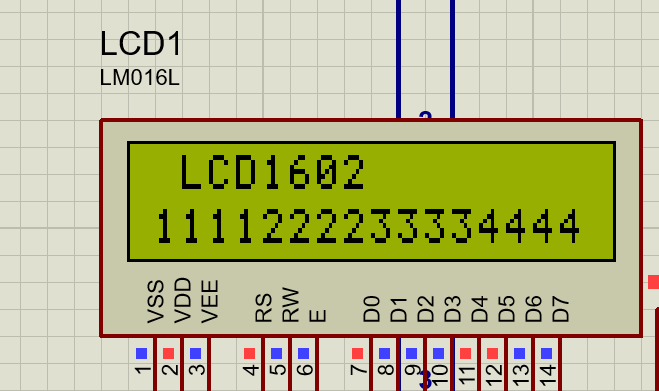

# STM32F03C8T6_Learning
# Explain: STM32F03C8T6 USE_STDPERIPH_DRIVER(V3.5.0)

## Test:
(1) proteus 8.15 simulation
(2) Board STM32F103C8T6

# DRV:
Describe: hardware driver 

(1) drvlcd1602: lcd1602, 8 line, simple project

test image:

